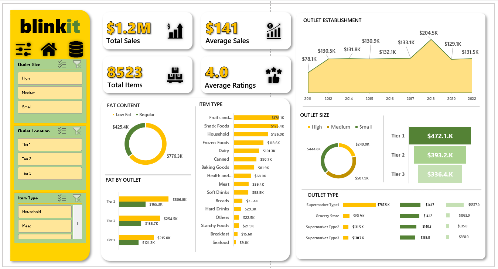

# Excel Project

# Introduction
This project focuses on analyzing grocery sales data from BlinkIT using Excel. The analysis highlights key metrics and trends, enabling better understanding of sales performance, item preferences, and outlet operations.

## Needs
Analyze sales trends across different outlet sizes, locations, and product categories.
Identify the best-performing product types and customer preferences for fat content.
Understand the impact of outlet types, sizes, and establishment years on total sales.
Provide insights to optimize inventory, outlet operations, and sales strategies.

## Solutions
### Comprehensive Excel Dashboard:
- Key metrics like Total Sales ($1.2M), Total Items (8,523), and Average Sales ($141).
- Segmentation of sales performance by outlet size (High, Medium, Small) and location tiers (Tier 1, Tier 2, Tier 3).
- Breakdown of item types and fat content preferences (Low Fat vs. Regular).
- Yearly trends showcasing sales growth and outlet establishment impact.

## Actionable Insights:
- Highlighted top-selling product categories (e.g., Fruits and Vegetables, Snack Foods).
- Outlet and location-based performance metrics for strategic planning.
- Optimized Decision-Making: Data-driven insights to improve inventory management, sales targeting, and operational efficiency.

